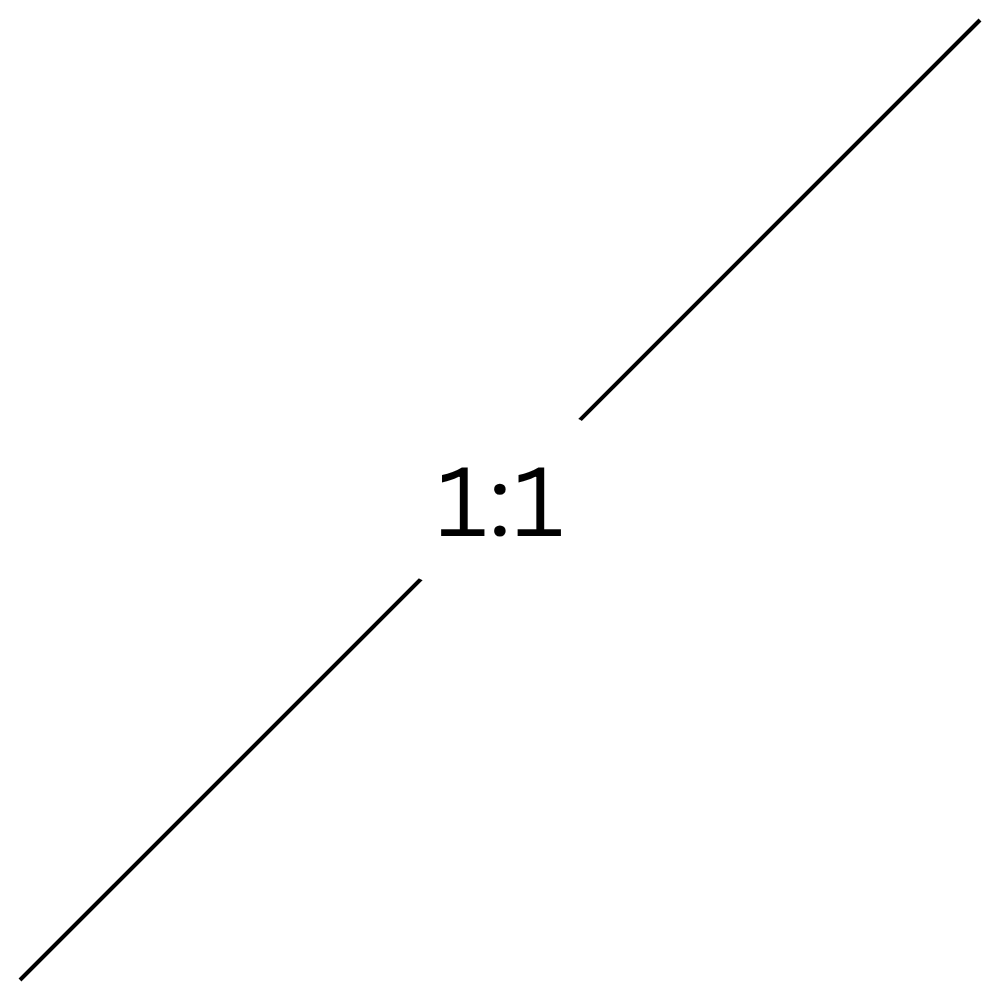
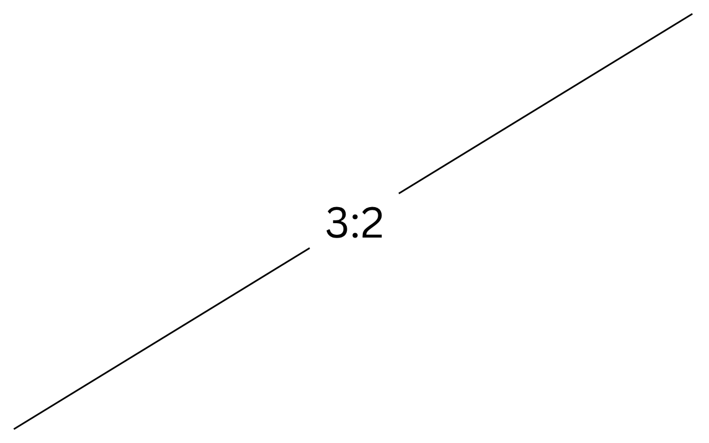

<h1 align="center" style="border-bottom: 0;">RoboRecycler - For the Congressional App Challenge</h1>

    

<h2 align="center">mini description here</h2>

RoboRecycler is a game created for the 2025 Congressional App Challenge, in Maryland's 8th Congressional District. The game follows the player, who is recruited to clean up their neighborhood which has been plagued by trash, air pollution, and more.

The player must travel to neighborhoods and other everyday locations, to battle trash-based enemies, and collect the trash/byproducts that are dropped by them after defeat. At the end of every "run", the player must battle a bigger enemy, which they have the chance to catch, recycle, and recruit to their team to help them battle other trash enemies.

Similar to Pokémon or Overwatch, the player can continuously go into "runs" to collect more trash, which they can then recycle and improve their abilities with.

## License

This project is licensed under the [GNU Affero General Public License v3 (AGPLv3)](https://www.gnu.org/licenses/agpl-3.0.en.html).